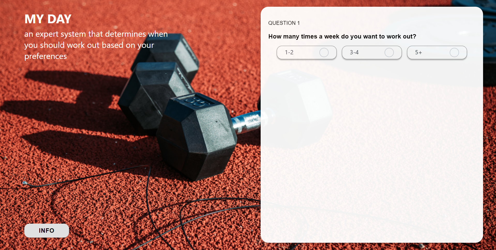
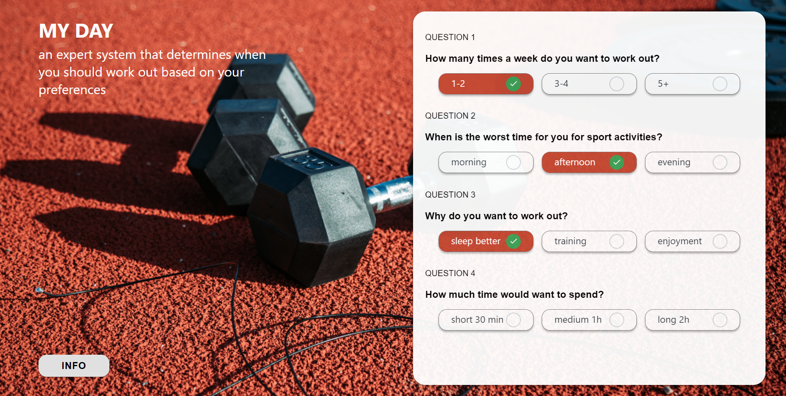

# My Day Expert System


## About

**My Day** is an expert system that determines when you should work out based on your preferences. \
It was written in JavaScript (React), using a modified forward-chaining algorithm that analyzes 81 rules. 

We went over these different scenarios and hopefully, the results satisfy your inquiry about when is the best time for a workout. This is **not a scientific quiz** and the results are based on our own personal experience and expertise. 


## Installation

Clone the project locally or you can run the following if you have Git installed:

```
git clone https://github.com/TeamFrost/My-Day-Expert-System.git
cd My-Day-Expert-System
```
In the project directory, you should run:

```node.js
npm install 
npm start
```

Runs the app in the development mode.\
Open [http://localhost:3000](http://localhost:3000) to view it in the browser.

The page will reload if you make edits.\
You will also see any lint errors in the console.

## Usage

After running the project, the following will appear at [http://localhost:3000](http://localhost:3000)



The system consists of 4 questions with 3 options for answers. The following table shows all the options for questions:


| Questions  | Option #1 |  Option #2  | Option #3 |
| ------------- | ------------- | -------------  | ------------- |
| How many times a week do you want to work out?  | 1-2  | 3-4   | 5+  |
| When is the worst time for you for sports activities?| morning  | afternoon   | evening  |
| Why do you want to work out?| sleep better  | training   | enjoyment  |
| How much time would want to spend?| short 30 min  | medium 1h   | long 2h  |

You can choose just one option for each question, and after pressing the **SUBMIT** button, the system will show your result based on the preset rules. Each variation of options will result in a different solution. After the result, you can take the quiz again, by pressing the **TAKE AGAIN** button. 

It's important to select your option for all the questions for the quiz to work. Otherwise, it will show the ***Please complete all fields*** message


Pressing the **INFO** button will provide a paper with some information about the system. It can be toggled off by pressing the button again.

## Data Structure

The system contains 81 rules in a form of an object with the following fields:
```Javascript
{
    premises: [
            { attribute: 'category', value: 'sport' },
            { attribute: 'occurance', value: '1-2' },
            { attribute: 'no_time', value: 'morning' },
            { attribute: 'reason', value: 'sleep better' },
            { attribute: 'duration', value: 'short' }
        ],
    conclusion: { attribute: 'result', value: '20:00-20:30 Monday Friday' }
}, // 1
```
The system will take the input from the user (by pressing one of the radio buttons) and will store the values for the relevant attributes (**occurrence, no_time, reason, duration**). After all the fields are completed, the system will output the value for the **result** attribute.

## Screenshots




## Inspiration

The forward-chaining algorithm was inspired by the [primaryobjects/knowledgebase](https://github.com/primaryobjects/knowledgebase). Our system is using a modified version of that algorithm, without the need to input data sequentially.

## Learn More
The system was created using React, following the links, you can learn more in the [Create React App documentation](https://facebook.github.io/create-react-app/docs/getting-started).

To learn more about React, check out the [React documentation](https://reactjs.org/).

### Code Splitting

This section has moved here: [https://facebook.github.io/create-react-app/docs/code-splitting](https://facebook.github.io/create-react-app/docs/code-splitting)

### Analyzing the Bundle Size

This section has moved here: [https://facebook.github.io/create-react-app/docs/analyzing-the-bundle-size](https://facebook.github.io/create-react-app/docs/analyzing-the-bundle-size)

### Making a Progressive Web App

This section has moved here: [https://facebook.github.io/create-react-app/docs/making-a-progressive-web-app](https://facebook.github.io/create-react-app/docs/making-a-progressive-web-app)

### Advanced Configuration

This section has moved here: [https://facebook.github.io/create-react-app/docs/advanced-configuration](https://facebook.github.io/create-react-app/docs/advanced-configuration)

### Deployment

This section has moved here: [https://facebook.github.io/create-react-app/docs/deployment](https://facebook.github.io/create-react-app/docs/deployment)

## License
[MIT](https://choosealicense.com/licenses/mit/)